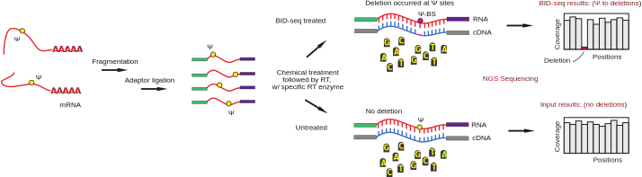

[](https://hub.docker.com/r/y9ch/bidseq)

# &Psi;-BID-seq

## Overview of the workflow

<p align="center">
  <a href="https://y9c.github.io/pseudoU-BIDseq/Overall-Workflow#gh-light-mode-only">
    
  </a>
  <a href="https://y9c.github.io/pseudoU-BIDseq/Overall-Workflow#gh-dark-mode-only">
    
  </a>
</p>

## How to use it?

A [docker image](https://hub.docker.com/r/y9ch/bidseq) containing the source code and dependencies has been published for reproducibility. You can run it using the [apptainer](https://apptainer.org/help) container runtime.

The entire analysis can be completed in just three steps:

1. **Specific the path of references (_.fasta_) and samples (_.fastq_) in a configure file (_.YAML_).**

   <details>
     <summary><code>data.yaml</code> for example<sup>(Click to expand)</sup></summary>

   ```yaml
   reference:
     contamination:
       fa: ./ref/contamination.fa
     genes:
       fa: ./ref/genes.fa
     genome:
       fa: /data/reference/genome/Mus_musculus/GRCm39.fa
       star: /data/reference/genome/Mus_musculus/star/GRCm39.release108

   samples:
     mESCWT-rep1-input:
       data:
         - R1: ./test/IP16.fastq.gz
       group: mESCWT
       treated: false
     mESCWT-rep1-treated:
       data:
         - R1: ./test/IP4.fastq.gz
       group: mESCWT
       treated: true
     mESCWT-rep2-treated:
       data:
         - R1: ./test/IP5.fastq.gz
       group: mESCWT
       treated: true
   ```

   You can copy and edit from this [template](test/data.yaml).

   _Read the [documentation](https://y9c.github.io/pseudoU-BIDseq/Step-by-step-instruction.html#define-settings-in-the-configure-file) on how to customize._

   </details>

2. **Run all the analysis by one command**:

   ```bash
   apptainer run docker://y9ch/bidseq
   ```

   <details>
       <summary>The pipeline will load configure file named `data.yaml` under the current directory.<sup>(Click to expand)</sup></summary>

   - Customized configure file with `-c` argument. (default: `data.yaml`)
   - Customized number of jobs/cores in parallel `-j` argument. (default: `48`)

   </details>

3. **View the analytics reports and filtered sites.**

   <details>
      <summary>3 folders are will be created in the working directory (default: `workspace`).<sup>(Click to expand)</sup></summary>

   <code>
   ├── align_bam
   ├── <b>report_reads</b>
   └── <b>filter_sites</b>
   </code>

   - trimming, mapping, and deduping reports are in `report_reads` folder, with key numbers in all the steps reported in one webpage<sup>([example](https://y9c.github.io/pseudoU-BIDseq/readsStats))</sup>.
   - filtered sites for &Psi; detection are in the `filter_sites` folder. These sites are only passed the _simplest filtering_, you can apply customized thresholds to them based on your data type and quality.
   - processed mapping results (_.bam_) are in `align_bam` folder. You can zoom into a location that you are interested in IGV.

   </details>

## Documentation

[Read more](https://y9c.github.io/pseudoU-BIDseq)

## Citation

- Dai Q. _et al_. Quantitative sequencing using BID-seq uncovers abundant pseudouridines in mammalian mRNA at base resolution. Nat Biotechnol (2022). https://doi.org/10.1038/s41587-022-01505-w

&nbsp;

<p align="center">
  
</p>
<p align="center">
  Copyright &copy; 2021-present
  <a href="https://github.com/y9c" target="_blank">Chang Y</a>
</p>
<p align="center">
  <a href="https://github.com/y9c/pseudoU-BIDseq/blob/master/LICENSE">
  
  </a>
</p>
